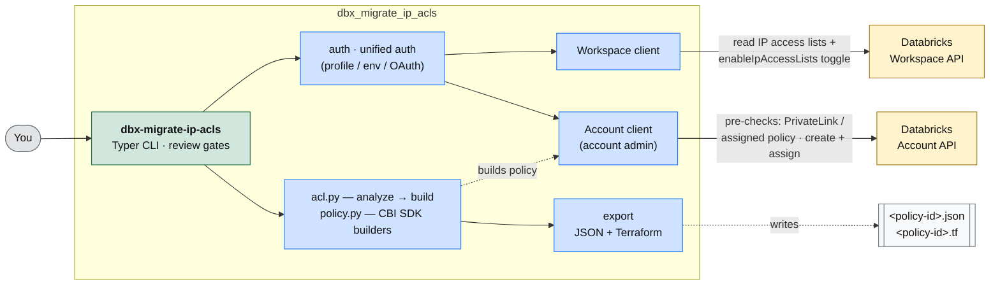
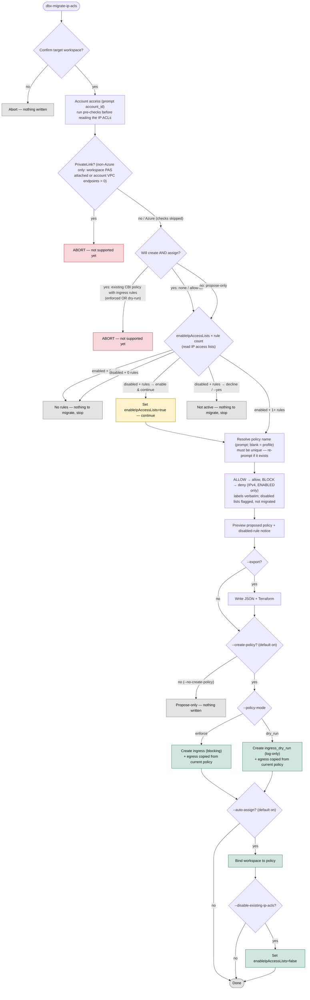

# 🔁 Databricks Migrate IP ACLs

[](https://github.com/andyweaves/databricks-migrate-ip-acls/actions/workflows/ci.yml)
[](https://codecov.io/gh/andyweaves/databricks-migrate-ip-acls)

Recreate a Databricks workspace's **existing IP access list** as a **context-based ingress (CBI) policy** via a single, focused CLI: **`dbx-migrate-ip-acls`**.
> 💡 Looking for traffic-analysis-based ingress/egress policy generation? Those live in the sibling tool - 
> **[databricks-network-policy-helper](https://github.com/andyweaves/databricks-network-policy-helper)**
> (`ingress` / `egress`). 

## ⚠️ Warning

A network policy is a **security-enforcing** control. This tool recreates your **current** IP access
list as-is; it does not judge whether that ACL is correct or complete. You are responsible for
reviewing every rule (and the disabled-rule notice) before applying — an incorrect or incomplete
allow-list can block legitimate users (in enforce mode) or fail to block malicious ones. Trial with
`--policy-mode dry_run` first if unsure.

## 🚀 Quick start

```bash
uv sync

# Propose-only (writes nothing): read the IP ACL and preview the CBI policy
uv run dbx-migrate-ip-acls --profile my-workspace --account-id <acct-id> \
    --no-create-policy --no-auto-assign

# Migrate for real: create the policy (enforce) and bind this workspace to it
uv run dbx-migrate-ip-acls --profile my-workspace --account-id <acct-id>
```

Or install the CLI on your PATH:

```bash
uv tool install .
dbx-migrate-ip-acls --help
```

Auth is the Databricks SDK's unified auth (`--profile`, `DATABRICKS_*` env, or OAuth).
**Account-admin credentials are always required** — the pre-checks and create/assign are all
account-level (see *Account access* below).

## 🏗️ Architecture

At a high level: the CLI reads the workspace's IP access lists through a **workspace client**, and
does every check + write through an **account-admin client** against the Databricks **account** APIs.
The engine turns the ACL into a CBI policy dataclass — carrying over the workspace's current egress
verbatim — which is previewed, optionally exported (JSON + Terraform), and — once you confirm —
created and bound to the workspace.



## 🗺️ How it flows



## 🧰 What it does

1. **Right after the workspace is chosen** — and *before* the IP access lists are read or shown —
   runs account-level **pre-checks**, so an unsupported or already-migrated workspace fails fast. It
   prompts for the `account_id` if it wasn't passed, then aborts on **PrivateLink** — this workspace
   has a PAS attached, or the **account** has ≥1 registered VPC endpoint (any workspace; CBI private
   access isn't GA yet, so any PrivateLink account is blocked for now) — not supported yet; **both
   PrivateLink checks are skipped on Azure**, which has neither concept, so an Azure workspace only
   migrates its IP ACLs; and, only when the run will **assign** the new policy, guards an existing
   **restrictive** CBI ingress policy already bound to the workspace — enforced **or** dry-run →
   **abort** (migrating on top of an existing CBI ingress policy isn't supported yet). An allow-all
   policy such as the account's baseline `default-policy` is ignored.
2. Then decides whether there's anything to migrate, from the workspace-wide `enableIpAccessLists`
   toggle × the number of IP access lists:
   - **disabled + 0 rules** → nothing to migrate → exit.
   - **disabled + 1+ rules** → the rules aren't in effect. It prints the current IP-ACL config and
     (interactively) offers to **enable** them: **yes** → sets `enableIpAccessLists=true` and
     **continues** in the same run; **no** → exits. `--yes` never auto-flips the toggle.
   - **enabled + 0 rules** → nothing to migrate → exit.
   - **enabled + 1+ rules** → proceed. (Unreadable toggle → warn + proceed.)
3. Reads the workspace's IP access lists (`w.ip_access_lists.list()`). **Individual lists that are
   disabled are flagged and NOT migrated** — only enabled lists are; the disabled ones are called
   out in the final printout so you can vet them. Maps **ALLOW → allow rules**, **BLOCK → deny
   rules** (IPv4 only; CBI is IPv4-only), recreating each rule **verbatim** — the original ACL
   label, no prefix, no mode suffix. The one thing it adds: if the ACL has **only BLOCK lists**, a
   catch-all allow (all public IPs) is added, because CBI RESTRICTED_ACCESS is default-deny —
   without it a deny-only policy would block everything.
4. Names the new policy from `--policy-name` (or prompts; blank = the profile name). It only
   **creates new** policies, so a name that already exists re-prompts (or aborts non-interactively).
   `--create-policy` is **on by default** (a review gate still confirms); with `--auto-assign`
   (default on) it binds the current workspace.
5. With `--disable-existing-ip-acls` (off by default), after the policy is created **and** assigned,
   turns off the workspace's IP access list enforcement (`enableIpAccessLists=false`) so the old ACL
   and the new CBI policy don't both apply. The lists themselves are preserved (reversible).

> This tool deliberately does **not** enrich or auto-allow Databricks' own control-plane IPs — it
> assumes the existing ACL is what you want. It recreates the **ingress** (the IP ACLs) and, for
> **egress**, copies the egress of the policy the workspace currently runs under **verbatim** — its
> enforcement mode, allowed internet (FQDN) + storage destinations, and blocked-internet lists — so
> egress posture is preserved rather than reset. The source is the workspace's assigned policy, or the
> account baseline `default-policy` when nothing is assigned; only when neither is readable does it
> fall back to a permissive `FULL_ACCESS` egress. This is automatic — there is no egress flag.

## ⚙️ Options

| Option | Meaning |
|---|---|
| `--profile` | Databricks CLI/config profile. Prompted if omitted (never guessed). |
| `--policy-mode enforce\|dry_run` | `enforce` (default) blocks non-matching source IPs once assigned; `dry_run` is log-only. |
| `--policy-name` | The new policy's id. If omitted you're prompted (blank there = the profile name, falling back to the workspace id). Normalised to a lowercase, `-`-safe id, capped at 30 chars. |
| `--export <path>` | Write the proposed policy JSON **and** a sibling best-effort Terraform `.tf` (`databricks_account_network_policy` — review before `terraform apply`). A directory writes `<policy-id>.{json,tf}` inside it (use `--export .` for the current dir); missing parents are created. Works in propose-only mode too. |
| `--auto-assign` / `--no-auto-assign` | Bind the current workspace to the new policy (default **on**). |
| `--create-policy` / `--no-create-policy` | Master write switch. **On by default** (a review gate still confirms). For a propose-only run: `--no-create-policy --no-auto-assign`. |
| `--disable-existing-ip-acls` | After create **and** assign, turn off the workspace's IP access lists. Requires create + assign **and** `--policy-mode enforce`. Off by default. |
| `--account-id` (+ account-admin creds) | Account-level (pre-checks and create/assign). When unset it **defaults to the workspace profile's own `account_id`**, else prompts. |
| `--account-host`, `--account-profile` | Account API host (when unset, **derived from the workspace's environment** — AWS staging / GCP / Azure — falling back to the AWS prod console) / a dedicated profile for account-level calls. When `--account-profile` is unset, the CLI **auto-selects a config profile whose host + account_id match** the target account, so account calls don't fall back to an ambient credential. |
| `--yes`, `-y` | Non-interactive: skip the step-through pauses and the review/write gate. `--yes` **will** create + assign. |

**Invalid flag combinations** (rejected up front — before the profile prompt or any account call, so
they fail instantly): `--no-create-policy` with `--auto-assign` (nothing to bind);
`--disable-existing-ip-acls` without both create + assign, or with `--policy-mode dry_run` (both
would leave the workspace with no enforced ingress control).

## 🔒 Account access

Every run is account-level: the pre-checks (PrivateLink / existing assigned policy) read account
APIs, and create/assign write them. Pass `--account-id <numeric id>` with **account-admin**
credentials resolvable by unified auth for the account host (an account-admin service principal via
OAuth M2M is the recommended path). A workspace-only OAuth session **cannot** call the account API —
use `--account-profile` (or env) for account creds if your workspace profile can't.

`--account-id` isn't usually typed: it **defaults to the workspace profile's `account_id`** when set.
Likewise, if you don't pass `--account-profile`, the CLI looks in your Databricks config for a profile
whose **host and `account_id` both match** the target account and uses it automatically (matching on
both, since an `account_id` alone is ambiguous across profiles and environments). If exactly one
matches it's used; none → it falls back to unified auth (and the account-access check fails fast with
a clear message if that credential is wrong); several → it uses the first and tells you.

The **account host** is chosen to match the workspace's environment: unless you pass `--account-host`,
it's derived from the workspace host (e.g. an AWS *staging* workspace →
`accounts.staging.cloud.databricks.com`; GCP → `accounts.gcp.databricks.com`; Azure →
`accounts.azuredatabricks.net`), falling back to the AWS prod console when it can't be determined. So
a non-prod workspace no longer fails against the wrong account API.

## 📈 Usage tracking

At startup the tool registers `databricks-migrate-ip-acls/<version>` as a Databricks SDK
[user-agent extra](https://databricks-sdk-py.readthedocs.io/), so it's appended to the `User-Agent`
header of every API call it makes. That lets platform-side logs attribute API traffic to this tool.
It adds only the tool name + version — no arguments, workspace data, or PII. Granularity is
**workspace-level**: cluster ids are redacted in the request logs, so per-DBU attribution isn't
possible. See `usage.py`.

## 🗂️ Repo layout

| Path | What |
|---|---|
| `src/dbx_migrate_ip_acls/cli.py` | The Typer CLI (single command) + interactive gates. |
| `src/dbx_migrate_ip_acls/acl.py` | The migration engine + network-policy state queries. |
| `src/dbx_migrate_ip_acls/policy.py` | SDK dataclass builders + policy-id naming. |
| `src/dbx_migrate_ip_acls/terraform.py` | Best-effort Terraform (HCL) rendering of the proposed policy. |
| `src/dbx_migrate_ip_acls/usage.py` | Registers the tool name in the SDK User-Agent (usage tracking). |
| `src/dbx_migrate_ip_acls/{config,auth,console,render,tls}.py` | Config/validation, auth, Rich UI, presentation, OS-trust-store TLS. |
| `tests/` | Offline unit tests (fakes/monkeypatch — no network). |

## 🧪 Development & tests

```bash
uv run pytest -q                      # tests (fully offline)
uv run pytest --cov=dbx_migrate_ip_acls --cov-report=term-missing   # with coverage
uv run ruff check src/ tests/         # lint
uv run black --check src/ tests/      # style (run `uv run black src/ tests/` to format)
```

Tests are fully offline (SDK clients and workspace/account reads are faked or monkeypatched).

**CI** (`.github/workflows/ci.yml`) runs ruff + `black --check` + pytest-with-coverage on every push
and PR across Python 3.10–3.12, and uploads coverage to Codecov (the badge above).

## 📦 Releasing

Releases are **fully automated** — there is no manual upload step:

1. Bump `version` in `pyproject.toml`.
2. Tag and push: `git tag vX.Y.Z && git push origin vX.Y.Z`.

The `release.yml` workflow then builds the sdist + wheel and publishes to **PyPI via Trusted
Publishing (OIDC)** — no stored token. One-time PyPI setup is required (Project → Publishing):
owner `andyweaves`, repo `databricks-migrate-ip-acls`, workflow `release.yml`, environment `pypi`.
